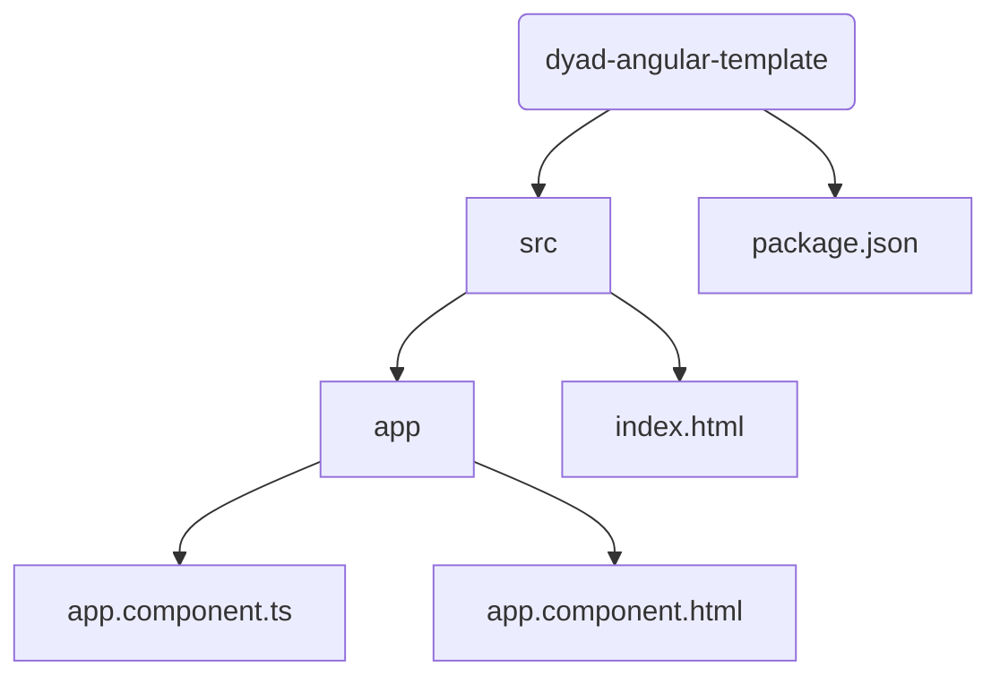
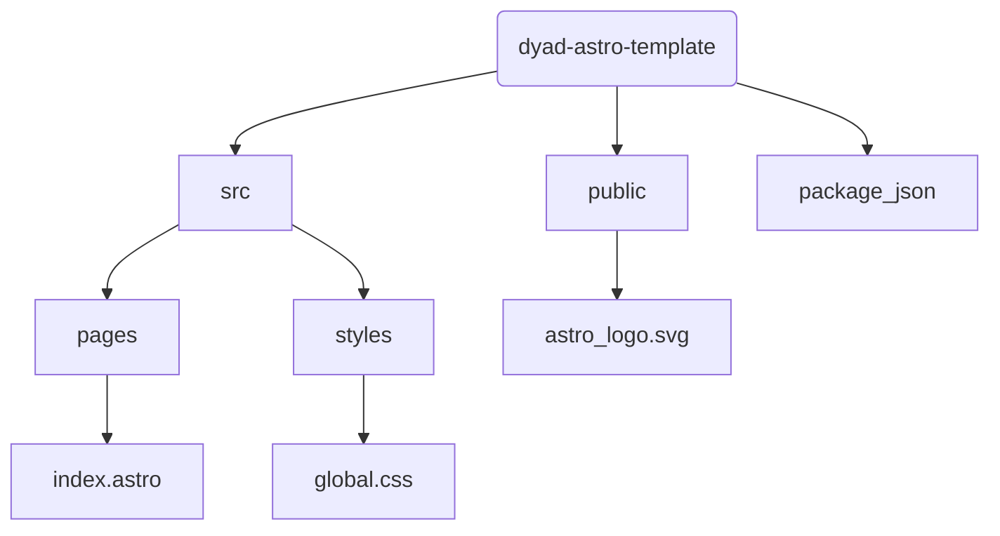
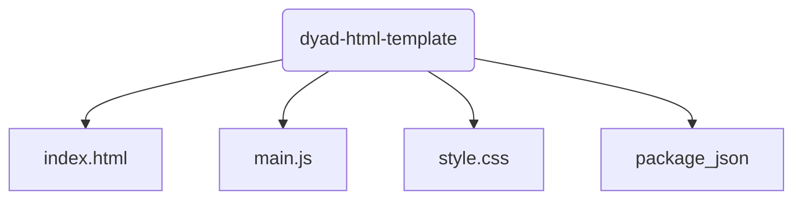
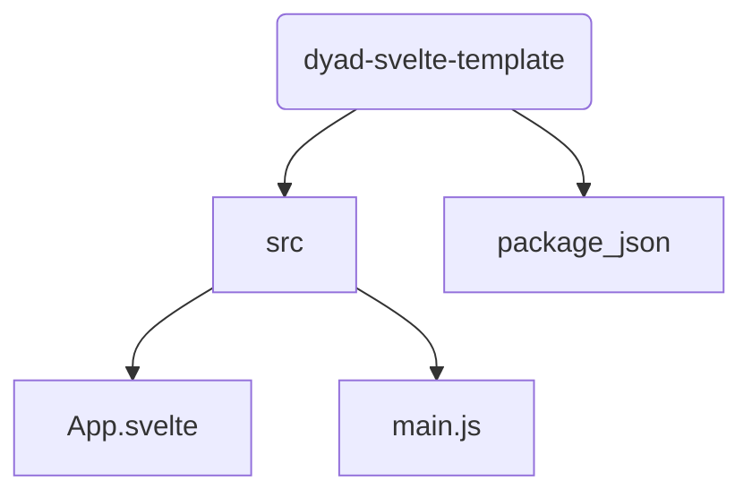
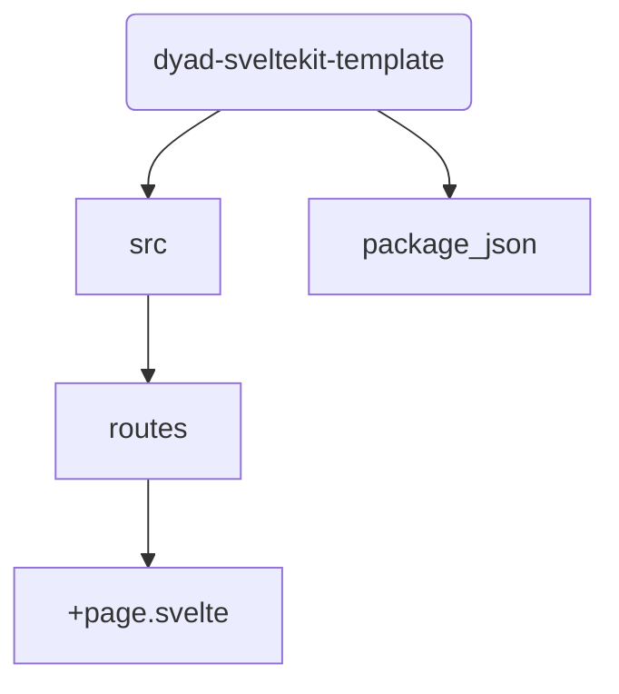
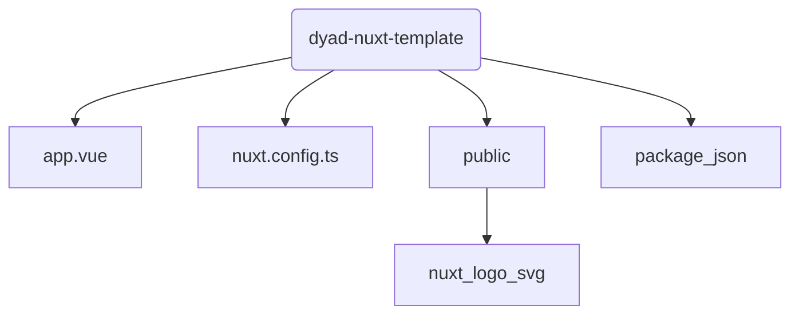
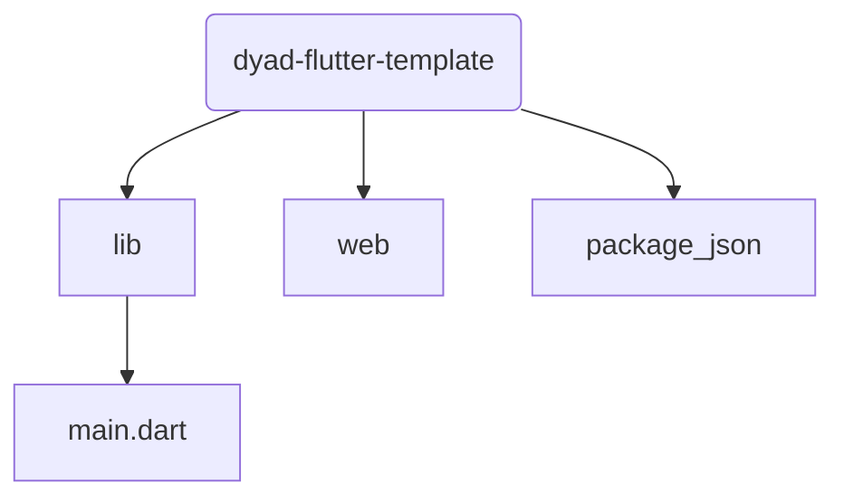
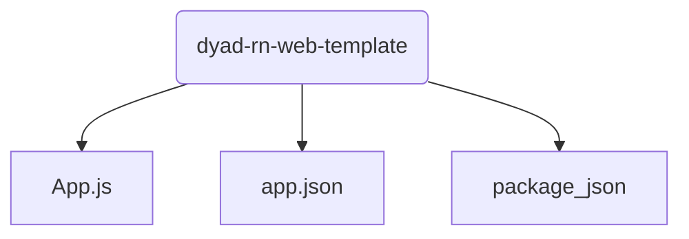

# Build Spec — Dyad.sh Template Implementation Guide

This specification accompanies [`Template Guide (PRD).md`](Template Guide%20(PRD).md:1) and translates each high-level requirement into concrete, repeatable build steps that any engineer or automation agent can follow to generate minimal, Dyad-compatible templates.

---

## 1. How to use this document
1. Pick the desired technology stack.  
2. Follow the **Universal Quality Standards** first.  
3. Execute the **Setup Steps** for the chosen template.  
4. Verify directory layout matches the Mermaid diagram.  
5. Run the **Dev / Build / Preview** scripts inside Dyad.sh.  
6. Remove scaffold cruft, commit, and publish.

---

## 2. Universal Quality Standards

| # | Guideline | ✅ Checklist |
|---|-----------|-------------|
| 1 | **Minimalism & Clarity** – keep to “hello-world” scope, add concise comments | [ ] |
| 2 | **Latest-Stable Dependencies** – no beta / rc versions | [ ] |
| 3 | **Dyad-compatible Scripts** – `dev / start / build / preview` as applicable | [ ] |
| 4 | **README.md** – description, quick-start, build commands | [ ] |
| 5 | **Cleanup** – delete tests, example assets, config clutter | [ ] |

---

## 3. Template-by-Template Build Specs

Each subsection follows the same schema:

1. Overview & Goals  
2. Prerequisites  
3. Setup Steps (CLI commands)  
4. Minimal Directory Tree (Mermaid)  
5. Key File Highlights  
6. Dev / Build / Preview Scripts  
7. Cleanup & Next Steps

### 3.1 Angular

**Overview & Goals**  
Minimal client-side Angular SPA named `dyad-angular-template`.

**Prerequisites**  
* Node.js ≥ 20  
* `npm install -g @angular/cli` (latest stable)

**Setup Steps**
```bash
npx @angular/cli new dyad-angular-template \
  --style=css --routing=false --skip-tests
cd dyad-angular-template
```

**Minimal Directory Tree**


**Key File Highlights**  
[`src/app/app.component.html`](src/app/app.component.html:1): centered logo + welcome text  
[`src/app/app.component.css`](src/app/app.component.css:1): flexbox centering.

**Scripts**

| Command | Action |
|---------|--------|
| `npm start` | launches `ng serve` on `http://localhost:4200` |
| `npm run build` | generates `dist/` production bundle |

**Cleanup & Next Steps**
* Delete autogenerated `app.component.spec.ts`.  
* Add minimal `README.md`.

---

### 3.2 Astro

**Overview & Goals**  
Static site scaffold using Astro “Empty” template.

**Prerequisites**  
Node.js ≥ 20

**Setup Steps**
```bash
npm create astro@latest dyad-astro-template -- --template empty
cd dyad-astro-template
```

**Minimal Directory Tree**


**Key File Highlights**  
[`src/pages/index.astro`](src/pages/index.astro:1): imports `../styles/global.css`, simple markup.  
[`src/styles/global.css`](src/styles/global.css:1): centers content.

**Scripts**

| Command | Action |
|---------|--------|
| `npm run dev` | runs `astro dev` |
| `npm run build` | outputs static site to `dist/` |

**Cleanup & Next Steps**
* Remove sample pages if generator adds any.  
* Add Astro logo to `public/`.

---

### 3.3 HTML/CSS/JS (Vite Vanilla)

**Overview & Goals**  
Vanilla “hello world” using Vite vanilla template.

**Prerequisites**  
Node.js ≥ 20

**Setup Steps**
```bash
npm create vite@latest dyad-html-template -- --template vanilla
cd dyad-html-template
```

**Minimal Directory Tree**


**Key File Highlights**  
[`index.html`](index.html:1) links `main.js` and hosts `<div id="app">`.  
[`main.js`](main.js:1) injects HTML into `#app`.  
[`style.css`](style.css:1) basic centering CSS.

**Scripts**

| Command | Action |
|---------|--------|
| `npm run dev` | Vite dev server |
| `npm run build` | optimized build in `dist/` |

**Cleanup & Next Steps**
* Delete `counter.js` if generator adds one.

---

### 3.4 Svelte (Vite)

**Overview & Goals**  
Client-side Svelte SPA with a click counter.

**Prerequisites**  
Node.js ≥ 20

**Setup Steps**
```bash
npm create vite@latest dyad-svelte-template -- --template svelte
cd dyad-svelte-template
```

**Minimal Directory Tree**


**Key File Highlights**  
[`src/App.svelte`](src/App.svelte:1): logo, counter, styles.  
`public/svelte-logo.svg` required.

**Scripts**

| Command | Action |
|---------|--------|
| `npm run dev` | vite dev |
| `npm run build` | vite build to `dist/` |

**Cleanup & Next Steps**
* Remove test files.

---

### 3.5 SvelteKit

**Overview & Goals**  
Minimal SvelteKit full-stack app with TypeScript.

**Prerequisites**  
Node.js ≥ 20

**Setup Steps**
```bash
npm create svelte@latest dyad-sveltekit-template
# choose "Skeleton project", enable TypeScript
cd dyad-sveltekit-template
```

**Minimal Directory Tree**


**Key File Highlights**  
[`src/routes/+page.svelte`](src/routes/+page.svelte:1): basic welcome page, inline styles.

**Scripts**

| Command | Action |
|---------|--------|
| `npm run dev` | SvelteKit dev server |
| `npm run build` | SvelteKit build |
| `npm run preview` | Preview production build |

**Cleanup & Next Steps**
* Remove `.svelte-kit/output` before committing.  
* Keep default adapter-auto unless deploying elsewhere.

---

### 3.6 Nuxt.js

**Overview & Goals**  
Minimal Nuxt SPA.

**Prerequisites**  
Node.js ≥ 20

**Setup Steps**
```bash
npx nuxi init dyad-nuxt-template
cd dyad-nuxt-template
npm install
```

**Minimal Directory Tree**


**Key File Highlights**  
[`app.vue`](app.vue:1): Logo + welcome text.  
[`nuxt.config.ts`](nuxt.config.ts:1): default config.

**Scripts**

| Command | Action |
|---------|--------|
| `npm run dev` | Nuxt dev server |
| `npm run build` | production build |
| `npm run generate` | static site export |

**Cleanup & Next Steps**
* Remove test utils.  
* Keep logo in `public/`.

---

### 3.7 Flutter for Web

**Overview & Goals**  
Flutter app configurable for web, runnable in Chrome.

**Prerequisites**  
* Flutter SDK ≥ stable  
* Node.js (needed only for Dyad scripts)

**Setup Steps**
```bash
flutter config --enable-web
flutter create dyad-flutter-template
cd dyad-flutter-template
```

**Minimal Directory Tree**


**Key File Highlights**  
`lib/main.dart` simplified welcome page.  
`package.json` manually added:
```jsonc
{
  "name": "dyad-flutter-template",
  "scripts": {
    "dev": "flutter run -d chrome",
    "build": "flutter build web --release"
  }
}
```

**Scripts**

| Command | Action |
|---------|--------|
| `npm run dev` | launches Flutter in Chrome |
| `npm run build` | web output in `build/web` |

**Cleanup & Next Steps**
* Remove Android/iOS folders if not needed in Dyad context.

---

### 3.8 React Native for Web (Expo)

**Overview & Goals**  
Expo-managed React Native app exported to static web.

**Prerequisites**  
Node.js ≥ 20, Expo CLI (`npm install -g expo-cli`)

**Setup Steps**
```bash
npx create-expo-app dyad-rn-web-template
cd dyad-rn-web-template
```

**Minimal Directory Tree**


**Key File Highlights**  
`App.js` hello-world with logo & styles.  
Expo automatically supplies `app.json`.

**Scripts**

| Command | Action |
|---------|--------|
| `npm start` | Expo DevTools |
| `npm run web` | launches web preview |
| `npm run build` | `expo export` → `dist/` |

**Cleanup & Next Steps**
* Remove unused native icons / splash assets.

---

## 4. Final Checklist
* [ ] Template builds without errors in Dyad.sh container.  
* [ ] README present & accurate.  
* [ ] No extraneous files committed.  
* [ ] Scripts documented in this spec run as described.

---

**End of Build Spec**